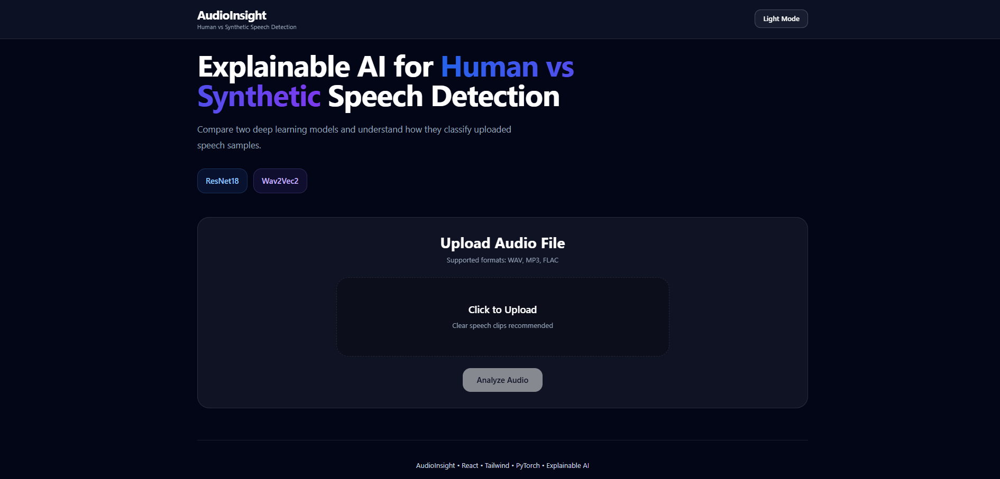
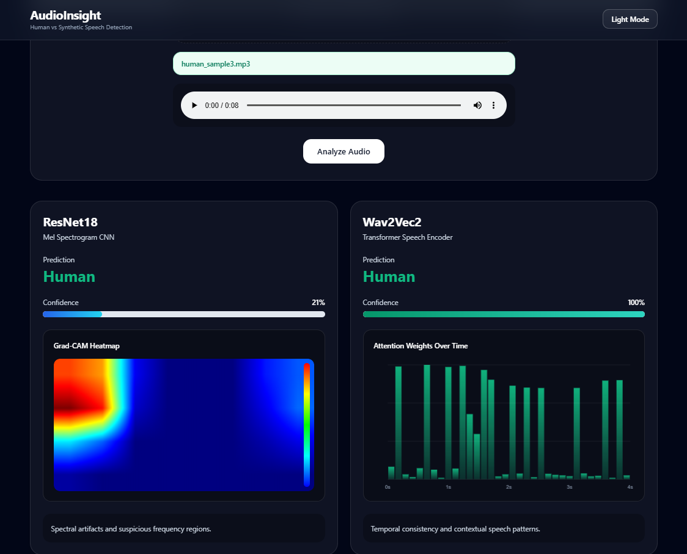
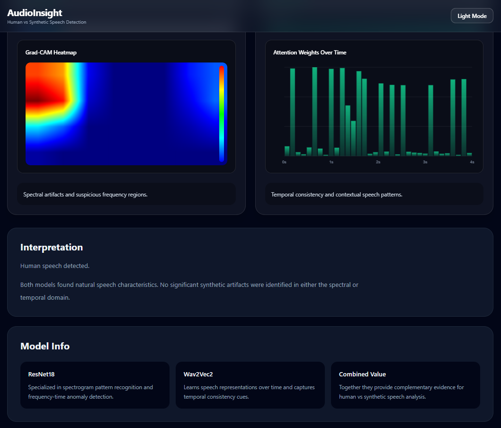

# AudioInsight — Deepfake Audio Detection

> Dual-model deepfake audio detection with interpretable predictions.  
> ResNet18 analyses the frequency domain. Wav2Vec2 analyses the temporal domain.  
> When they disagree, that disagreement is itself a signal.

**[Live Demo](#)** 

---

## What This Is

AudioInsight detects AI-generated speech by running two independently trained models on the same audio clip and comparing their findings. The system is designed around a core insight: **a CNN looking at spectrograms and a transformer listening to raw waveforms make different kinds of mistakes.** Combining them with explainability outputs makes the system more trustworthy than either model alone.

The project was built on top of the [ASVspoof 2019 LA benchmark dataset](https://www.asvspoof.org/), the standard evaluation benchmark for anti-spoofing research, and finetuned on modern neural TTS samples from ElevenLabs and Respeecher to improve real-world robustness.

---

## Results

Both models were evaluated on the ASVspoof 2019 LA eval set (71,933 samples).

| Model | EER ↓ | Recall ↑ | PR-AUC ↑ | Missed Detections ↓ |
|---|---|---|---|---|
| ResNet18 | **0.0469** | **0.9501** | 0.9990 | 3,188 |
| Wav2Vec2 | **0.0408** | **0.9001** | 0.9983 | 6,385 |

**Training data for both models:** ASVspoof 2019 LA (25,380 samples) + 600 modern TTS samples (ElevenLabs, Respeecher) + 1,000 LibriSpeech samples + noise augmentation.

Both models use ResNet18 (ImageNet-pretrained, partially frozen) and Wav2Vec2-base (HuggingFace, layers 10–11 unfrozen) as their respective backbones, with custom classification heads trained for binary spoof detection.

---

## Architecture

```
Audio Input (any format, any SR)
         │
         ▼
   Preprocessing
   ┌─────────────────────────────────────┐
   │  mono → 16kHz → trim/pad to 4s     │
   └──────────────┬──────────────────────┘
                  │
        ┌─────────┴──────────┐
        ▼                    ▼
  ResNet18 path         Wav2Vec2 path
  ┌─────────────┐       ┌─────────────┐
  │ Mel spectrogram     │ Raw waveform│
  │ + Δ + ΔΔ    │       │ [64000]     │
  │ [3, 128, T] │       │             │
  │             │       │ Per-sample  │
  │ ResNet18    │       │ z-norm      │
  │ (ImageNet   │       │             │
  │  pretrained)│       │ Wav2Vec2-   │
  │             │       │ base +      │
  │ Frozen:     │       │ attention   │
  │ stem, layer1│       │ pooling     │
  │             │       │             │
  │ Trained:    │       │ Frozen:     │
  │ layer2-4,fc │       │ layers 0-9  │
  │             │       │ Trained:    │
  │ FocalLoss   │       │ layers 10-11│
  │ α=0.75 γ=2  │       │ + head      │
  └──────┬──────┘       └──────┬──────┘
         │                     │
         ▼                     ▼
   P(AI) score           P(AI) score
   + GradCAM             + Attention
     heatmap               weights
         │                     │
         └──────────┬──────────┘
                    ▼
             Interpretation
             (confidence +
              agreement +
              divergence
              analysis)
```

---

## Why Two Models

The two models look at completely different representations of the same audio.

**ResNet18** converts audio into a mel spectrogram — a 2D image of frequency content over time. Neural vocoders (the synthesis engine behind most TTS systems) tend to leave characteristic artefacts in specific frequency bands. A CNN trained on spectrograms learns to recognise these frequency-domain fingerprints.

**Wav2Vec2** processes raw waveforms directly. It was pre-trained by Meta on 960 hours of LibriSpeech to learn general speech representations, then finetuned for binary classification. It captures temporal patterns — how phonemes transition, how prosody unfolds — that are harder to fake convincingly than spectral properties.

**The disagreement case is the most interesting one.** When ResNet18 says AI but Wav2Vec2 says Human, the most likely explanation is a high-quality TTS that preserves natural prosody (fooling the temporal model) but still leaves spectral traces (caught by the CNN). This asymmetric failure mode is itself diagnostic.

---

## Explainability

### Grad-CAM (ResNet18)
Gradient-weighted Class Activation Mapping highlights which regions of the mel spectrogram contributed most to the prediction. High activation in specific frequency bands at specific time positions indicates where the model found suspicious patterns.

### Attention Weights (Wav2Vec2)
The model uses soft attention pooling over the sequence of hidden states. The per-frame attention weights show which 20ms segments of the audio the model weighted most heavily when making its decision. Spikes in attention over silence or transitions often indicate where temporal inconsistencies were detected.

---

## Dataset

**Training:** ASVspoof 2019 Logical Access (LA) track
- 25,380 training samples (2,580 bonafide / 22,800 spoof)
- 19 different TTS/VC attack algorithms (A01–A19)
- Covers vocoder-based, waveform concatenation, and neural TTS attacks

**Finetuning data (additional):**
- 600 modern TTS samples — ElevenLabs and Respeecher (labelled spoof)
- 1,000 LibriSpeech samples (labelled bonafide)
- 2,000 real-world noise files for augmentation

**Evaluation:** ASVspoof 2019 LA eval set — 71,933 samples across 13 attack types

---

## Tech Stack

| Layer | Technology |
|---|---|
| ML Framework | PyTorch 2.x |
| Pretrained Models | torchvision ResNet18 (ImageNet), facebook/wav2vec2-base (HuggingFace) |
| Audio Processing | torchaudio, librosa |
| Backend | FastAPI, Python 3.11 |
| Frontend | React 19, TypeScript, Tailwind CSS |
| Visualisation | HTML Canvas (custom jet colormap, attention bar chart) |
| Training Platform | Kaggle (NVIDIA Tesla T4) |

---

## Project Structure

```
audioinsight/
├── backend/
│   ├── main.py           # FastAPI app, /health + /analyze endpoints
│   ├── inference.py      # Model architectures + checkpoint loading
│   ├── preprocess.py     # Audio loading, mel features, waveform pipeline
│   ├── xai.py            # GradCAM + attention weight extraction
│   ├── schemas.py        # Pydantic response models
│   ├── config.py         # Constants (SR, N_FFT, paths, thresholds)
│   ├── requirements.txt
│   └── models/           # Place .pth checkpoints here
│
├── frontend/
│   └── src/
│       ├── App.tsx
│       └── components/
│           ├── Navbar.tsx
│           ├── Hero.tsx
│           ├── UploadCard.tsx
│           ├── ModelPanel.tsx      # GradCAM + attention visualisation
│           ├── Interpretation.tsx  # Confidence-aware interpretation
│           └── Footer.tsx
│
└── notebooks/
    ├── 01_resnet18_training.ipynb | ResNet18 baseline — mel spectrogram preprocessing and initial training on ASVspoof 2019 LA
    ├── 02_resnet18_finetuning.ipynb | ResNet18 finetuning on ElevenLabs/Respeecher TTS + LibriSpeech with FocalLoss and WeightedRandomSampler
    ├── 03_wav2vec2_training.ipynb | Wav2Vec2 base training with attention pooling head, BCEWithLogitsLoss pos_weight=8.84
    └── 04_wav2vec2_finetuning.ipynb | Wav2Vec2 finetuning on modern TTS data with source-aware WeightedRandomSampler

```

## Running Locally

### Prerequisites
- Python 3.10+
- Node.js 18+
- Model checkpoints (see below)

### Backend

```bash
cd backend
pip install -r requirements.txt
```

Models are downloaded automatically from HuggingFace on first startup and automatically saved in:
```
backend/models/
├── resnet18_finetuned.pth
└── w2v_finetuned.pth
```

```bash
uvicorn main:app --reload --host 0.0.0.0 --port 8000
```

Visit `http://localhost:8000/health` to verify both models loaded.

### Frontend

```bash
cd frontend
npm install
```

Create a `.env.local` file:
```
VITE_API_URL=http://localhost:8000
```

```bash
npm run dev
```

### Supported Audio Formats
WAV, MP3, FLAC, OGG, M4A — any sample rate, mono or stereo. Audio is automatically resampled to 16kHz and trimmed/padded to 4 seconds.

---

## API

### `POST /analyze`

Upload an audio file and receive predictions from both models.

**Request:** `multipart/form-data`, field name `file`

**Response:**
```json
{
  "resnet_prediction": "AI",
  "resnet_score": 0.9823,
  "w2v_prediction": "Human",
  "w2v_score": 0.1204,
  "gradcam": {
    "values": [...],
    "rows": 128,
    "cols": 250
  },
  "attention": {
    "values": [...],
    "num_frames": 199
  },
  "interpretation": null,
  "duration_seconds": 4.0,
  "original_sr": 44100
}
```

### `GET /health`
```json
{
  "status": "ok",
  "device": "cuda",
  "resnet_loaded": true,
  "w2v_loaded": true
}
```

---

## Screenshots

### Homepage


### Result
<p align="center">
  
</p>

### Interpretation
<p align="center">
  
</p>


## Known Limitations

**Language coverage:** Both models were trained primarily on English speech (ASVspoof 2019 LA is English-only). Performance on non-English TTS is reduced, particularly for Wav2Vec2 which relies on learned speech representations that are language-sensitive.

**Modern neural TTS:** Systems like ElevenLabs v2, OpenAI TTS, and similar post-2023 models are significantly harder to detect. Finetuning on 600 ElevenLabs samples improved robustness but doesn't fully close the gap on the latest generation of synthesis systems.

**Audio length:** The system analyses the first 4 seconds. For longer clips, a sliding window approach would improve reliability.

**Threshold sensitivity:** Both models use a fixed decision threshold (0.5). In high-stakes deployments, threshold calibration per use-case would be necessary.

---

## Metrics Explained

**EER (Equal Error Rate):** The threshold at which false acceptance rate equals false rejection rate. Lower is better. An EER of 0.047 means approximately 4.7% error rate at the optimal operating point.

**PR-AUC (Area Under Precision-Recall Curve):** Measures detection quality across all thresholds, weighted toward performance on the positive (spoof) class. More informative than ROC-AUC under class imbalance. Values above 0.99 indicate near-perfect ranking.

**Recall:** Fraction of actual spoof samples correctly identified. Prioritised over precision because missed detections (false negatives) are more costly than false alarms in anti-spoofing.

---

## References

- ASVspoof 2019: [ASVspoof 2019: A large-scale public database of synthesized and converted speech](https://arxiv.org/abs/1911.01601)
- Wav2Vec2: [wav2vec 2.0: A Framework for Self-Supervised Learning of Speech Representations](https://arxiv.org/abs/2006.11477)
- Grad-CAM: [Grad-CAM: Visual Explanations from Deep Networks via Gradient-based Localization](https://arxiv.org/abs/1610.02391)

---

## Author

Built by **Rudransh Verma**. 
[LinkedIn](https://www.linkedin.com/in/rudranshi-verma/)
